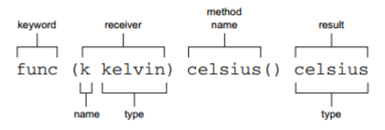

# 函数

## 函数声明
#### 使用`func`关键字声明函数
> func  SayHello( word   string )  string   
> 关键字 函数名   ( 参数名 参数类型 )  返回值类型

**【注意】大写字母开头的函数、变量都会被导出，对其他包可见（可理解为访问修饰符为`public`），如果是小写字母开头的话，则对其他包不可见（可理解为访问修饰符为`private`）。** 
举个简单的函数例子。
```go
//声明函数
func kelvinToCelsius(k float64) float64 {
	k -= 273.15
	return k
}

//使用函数
func main() {
	kelvin := 294.0
	celsius := kelvinToCelsius(kelvin)
	fmt.Println(kelvin, "°K is", celsius, "°C") //294 °K is 20.850000000000023 °C
}
```
#### 多入参形式   
> func Unix(sec int64, nsec int64) Time

如果多个入参的参数类型相同，可以像下面这样简写
> func Unix(sec, nsec int64) Time

#### 多返回值形式
在上一节遇到的函数`countdown, err := strconv.Atoi("10")`就是一种多返回值的函数，其声明的写法是(ASCII to integer)
> func Atoi(s string) (i int, err error) 

**多个返回值写在括号内，并且返回值可以将名字去掉只保留类型：**
> func Atoi(s string) (int, error)

举个简单的例子
```go
func reverse(a, b, c string) (string, string, string) {
	return c, b, a
}
```
或者
```go
func reverse1(a, b, c string) (x string, y string, z string) {
	x, y, z = c, b, a
	return
}
```
#### 可变参数函数
例如常用的`Println`函数，它可以接收一个参数、两个参数或更多参数。并且它可以接收不同类型的参数
```go
fmt.Println("Hello","World")
fmt.Println(186, "seconds")
```
其函数声明如下：
> func Println(a ...interface{}) (n int, err error)
1. ...表示函数的参数的数量是可变的
2. **参数a的类型为`interface{}`，是一个空接口。空接口可以接收所有类型**
> 所以，...和interface{}结合到一起，就可以接收任意数量任意类型的参数
看个简单的例子
```go
//addAll 多数相加
func addAll(a int, numbers ...int) int {
	sum := a
	for _, v := range numbers {
		sum += v
	}
	return sum
}

func main() {
	sum := addAll(3, 4, 5, 6, 7)
	fmt.Println(sum)  //output: 25
}
```


# 方法

## 声明新类型
### 通过`type`关键字来声明新的类型
通过`type`关键字，指定名称和一个底层类型便可以声明一个新的类型。
> type celsius float64
> 关键字  名称 底层类型  
```go
type celsius float64
var temperature celsius = 20
fmt.Println(temperature)
```
如上，声明了一个摄氏度的新类型叫celsius，由于数字字面量20是一个无类型常量，所以int，float64类型或者其他数字类型都可以将其做值。又因为celsius类型和float64具有相同的行为，可以把其当做float64来使用
```go
const degrees = 20
var temperature2 celsius = degrees
temperature2 += 10
fmt.Println(temperature2) //30
```
**【注意】** 虽然声明的新类型和声明时指定的底层类型具有相同的行为与表示，但是这和前面提过的类型别名不同，通过type关键字声明的类型就是一个全新的类型。所以尝试把celsius和float64一起使用会报错“类型不匹配”
fahrenheit 华氏温度 celsius 摄氏
```go
var warmUp float64 = 10
temperature += warmUp   //报错
```
通过自定义新类型可以提高代码的可读性。如下面的代码，因为摄氏度和华氏度是两个不同的类型，它们是无法一起直接比较或运算的。
```go
type fahrenheit float64

var c celsius = 20
var f fahrenheit = 20

if c == f {  //报错

}
c += f  //报错
```
## 引入自定义类型
在声明了新的类型之后，我们可以在函数或者其他地方去使用。我们将之前的`kelvinToCelsius`函数使用新类型进行改写，将参数类型和返回值类型都改用自定义类型。
```go
//type关键字声明新类型
type celsius float64
type kelvin float64

//kelvinToCelsius converts °K to °C
func kelvinToCelsius(k kelvin) celsius {
	return celsius(k - 273.15) //需要使用类型转换
}

func main() {
	//使用引入了新类型的函数
	var k kelvin = 294.0
	c := kelvinToCelsius(k)
	fmt.Println(k, "°K is", c, "°C") //294 °K is 20.850000000000023 °C

}
```

## 通过方法添加行为
在以往面向对象的语言中，方法一般都是属于某个类的。但是在Go中不一样，Go中没有类或者对象，但是存在方法。在Go中可以为声明的类型（type关键字声明）关联方法。先看如何声明。

```go
func (接收者类型) 方法名(参数列表) 返回值类型 {

    // 方法的实现
}

type celsius float64
type kelvin float64

//为kelvin类型关联一个方法celsius
func (k kelvin) celsius() celsius{
	return celsius(k - 273.15)
}
```
这里的k称为接收者（receiver），每个方法可以有多个参数，但是只能有一个接收者。   


在声明好方法之后，类型kelvin就可以直接调用方法了，用起来就和在类中定义了方法很类似。
```go
var k kelvin = 294.0
c := k.celsius()
fmt.Println(k, "°K is", c, "°C") //294 °K is 20.850000000000023 °C
```


# 一等函数

在Go语言中，函数是 **一等值** ，可以用在整数、字符串或其他类型能够应用的所有地方。也就是函数好像一个对象那样去使用，有python，js内味儿。简单点说就是
* 可以将**函数赋值给变量**
* 可以将**函数传递给函数**
* 可以**编写创建并返回函数的函数**

## 将函数赋值给变量
【示例1——sensor.go】
```go
package main

import (
	"fmt"
	"math/rand"
)

type kelvin float64

//返回模拟温度的传感器
func fakeSensor() kelvin {
	return kelvin(rand.Intn(151) + 150)
}

//返回真实温度的传感器
func realSensor() kelvin {
	return 0
}

func main() {
	fmt.Println("lesson9 First-class functions")

	//【case1】将函数赋值给变量
	sensor := fakeSensor
	fmt.Println(sensor()) //output：156 (随机的)

	sensor = realSensor
	fmt.Println(sensor()) //output：0

	//fmt.Println(sensor) //报错：
}
```
以上，`sensor`变量的值是一个函数，而不是调用函数获取的结果值。无论赋值给`sensor`的是`fakeSensor`还是`realSensor`，`sensor`都可以通过`sensor()`来调用。   
另外，之所以能将`realSensor`重新赋值给`sensor`,是由于`realSensor`和`fakeSensor`具有相同的函数签名。

## 将函数传递给其他函数
因为变量既可以指向函数，又可以作为参数传递给函数，那么在Go中函数也可以作为参数传递给其他函数。可以联想下C#中委托的一种用法。   
【示例2——function-parameter.go】
```go
import (
	"fmt"
	"math/rand"
	"time"
)

//【case2】将函数传递给其他函数
//测量温度，使用传入的传感器测量samples次温度
func measureTemperature(samples int, sensor func() kelvin) {
	for i := 0; i < samples; i++ {
		k := sensor()
		fmt.Printf("%v° K\n", k)
		time.Sleep(time.Second)
	}
}

func main() {
    measureTemperature(3, sensor) //0° K (连续打印三次)
}
```

## 声明函数类型
之前我们使用过`type`关键字来声明类型，当时使用的底层类型是`float64`来声明了`kelvin`类型。同样函数也可以这样玩。
```go
type sensor func() kelvin
```
通过这样的声明之后，代码的可读性可以得到提升，并且之前定义的函数`measureTemperature`签名可以简写成
```go
func measureTemperature(samples int, s sensor)
```

## 闭包和匿名函数
Go语言支持匿名函数，匿名函数在Go中也称为“函数字面量”。先了解下简单的用法。
```go
//匿名函数
var f = func() {
	fmt.Println("Dress up for the masquerade")
}

func main() {
    //调用匿名函数
	f() //output：Dress up for the masquerade

	//将匿名函数赋值给函数中的变量
	ff := func(message string) {
		fmt.Println(message)
	}
	ff("Go to the party") //Go to the party

	//将匿名函数的声明和执行放在一起写
	func() {
		fmt.Println("function anonymous")
	}() //function anonymous
}
```
因为函数字面量需要保留外部作用域的变量引用，所以函数字面量都是闭包的。看一下闭包的示例。
```go
type kelvin float64
type sensor func() kelvin

func realSensor() kelvin {
	return 0
}

//声明并返回一个匿名函数
func calibrate(s sensor, offset kelvin) sensor {
	return func() kelvin {
		return s() + offset
	}
}

func main() {
	newSensor := calibrate(realSensor, 5)
	//calibrate函数已经返回，传入的变量继续起作用
	fmt.Println(newSensor()) 	//output：5
}
```
以上，calibrate返回的匿名函数引用了被calibrate函数用作形参的s和offset变量。尽管calibrate函数已经返回了，但是被闭包捕获的变量继续存在，因此sensor仍然能够访问这两个变量。