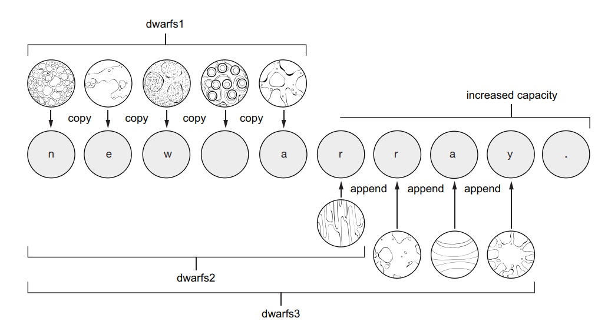

# 数组

数组的数据结构和其他语言中的数组没有什么太大区别。数组的声明写法如下，如果声明一个长度为8的字符串数组。
```go
var planets [8]string
var 变量名 [数组长度] 数据类型
变量名 := 数据类型 [数组长度] {初始化元素列表}
```
不同之处是Go中声明数组时，将中括号和数组长度的声明放在了类型之前。   
另外，关于数组元素的读写操作与其他常见语言无异。
```go
//Array of planets
var planets [8]string
planets[0] = "Mercury" //Assigns a planet at index 0
planets[1] = "Venus"
planets[2] = "Earth"

earth := planets[2] //retrieves the planet at index 2
fmt.Println(earth)  //Earth

//获取数组的长度，通过内建函数len()即可
fmt.Println(len(planets)) //8
```
在Go中，当对数组的读写越界之后也是会引发异常的。

## 使用复合字面值来初始化数组
**复合字面值**（composite literals）是一种给复合类型进行初始化的紧凑语法。通过这个语法可以只需一句代码就将对数组的声明与初始化同时完成。类似C#中的数组初始化器。
```go
dwarfs := [5]string{"Ceres", "Pluto", "Haumea", "Makemake", "Eris"}
```
更高级一点的用法，我们无需显式指定数组的长度，使用“...”来代替，Go编译器会自动帮我计算出数组的长度。
```go
planetCollection := [...]string{
    "Mercury",
    "Venus",
    "Earth",
    "Mars",
    "Jupiter",
    "Saturn",
    "Uranus",
    "Neptune",
}
fmt.Println(len(planetCollection)) //8
```
也可以使用索引来为数组赋初始值。
```go
array := [5]int{1: 10, 3: 30}
fmt.Printf("%+v\n", array) //[0 10 0 30 0]
```

## 遍历数组
### for循环遍历
* 使用 **for** 循环遍历数组
```go
dwarfs := [5]string{"Ceres", "Pluto", "Haumea", "Makemake", "Eris"}

for i := 0; i < len(dwarfs); i++ {
    dwarf := dwarfs[i]
    fmt.Println(i, dwarf)
}
```
* 使用 **range** 关键字来遍历数组，之前也介绍过
```go
dwarfs := [5]string{"Ceres", "Pluto", "Haumea", "Makemake", "Eris"}

//返回的两个参数，一个为索引 一个为对应的值
for i, dwarf := range dwarfs {
    fmt.Println(i, dwarf)
}
```

## 数组总是被深拷贝的
当我们声明了一个数组之后，无论是将这个数组赋值给其他变量还是作为参数传递给某个函数，都是将此数组的一个完整副本传递给变量或者函数的。
【示例】：将数组传递给变量

```go
planetCollection := [...]string{
    "Mercury",
    "Venus",
    "Earth",
    "Mars",
    "Jupiter",
    "Saturn",
    "Uranus",
    "Neptune",
}
planetsMarkII := planets //会将planets的完整副本赋值给planetMarkII
planets[2] = "whoops"    //改变了原数组planets，

//数组planetsMarkII是副本，所以不受影响
fmt.Println(planets[2])       //whoops
fmt.Println(planetsMarkII[2]) //Earth
```
【示例】：将数组传递给函数
```go
func terraform(planets [8]string){
    for i := range planets{
        planets[i] = "New " + planets[i]
    }
}

func main(){
    planetCollection := [...]string{
        "Mercury",
        "Venus",
        "Earth",
        "Mars",
        "Jupiter",
        "Saturn",
        "Uranus",
        "Neptune",
    }
    terraform(planets)
    fmt.Println(planets) //原数组无变动
}
```

### 浅拷贝和深拷贝区别

```
// 深拷贝
func pass_array_cut(arrays [8]string) {
	for i, array := range arrays {
		arrays[i] = array[:len(array)/2]
	}
}

// 深拷贝切片，返回一个新的切片
func pass_array_cut2(arrays []string) []string {
	newArray := make([]string, len(arrays)) // 创建新的切片
	for i, array := range arrays {
		newArray[i] = array[:len(array)/2] // 修改副本
	}
	return newArray // 返回新的切片
}
func pass_array(arrays []string) {
	for i, array := range arrays {
		arrays[i] = array + array
	}
}

//浅拷贝：pass_array 函数接收的是切片 []string，对它进行修改会直接影响原数组，因为切片是对数组的引用。
//深拷贝：pass_array_cut 函数接收一个数组 [8]string，并返回一个新的数组。这相当于对数组的每个元素进行了副本操作，而不修改原始数组。
```


**`make([]string, len(arrays))`**：`make` 是 Go 的内建函数，用于创建切片、映射（map）或通道（channel）。

1. **`[]string`**：这表示创建一个 `string` 类型的切片。切片是一种变长的数组，可以动态扩展，且无需指定长度（与数组不同）。
2. **`len(arrays)`**：`len(arrays)` 返回传入的 `arrays` 切片的长度。`make` 函数会创建一个和 `arrays` 一样长的新的切片 `newArray`，这样可以确保新切片与原切片在结构上相同。

**`newArray`**：这个变量存储的是一个新的切片，它的初始值为 `arrays` 的长度，其中的元素都是空字符串 `""`（因为未赋值的 `string` 类型默认是空字符串）。这个切片将用于存储原始切片的拷贝或修改后的内容。


**为什么使用 `make`？**

- **`make`** 的作用是预先分配一块内存来存储切片元素。创建切片时，`make` 可以根据你指定的长度和容量来分配底层数组。
- 通过 `make([]string, len(arrays))`，你创建了一个与原始切片 `arrays` 一样长的切片，这样你可以对它进行深拷贝操作（例如，对每个元素做修改），而不会影响到原始的 `arrays` 切片。

**使用场景：**

在深拷贝的场景下，你需要创建一个和原切片一样长的新切片来保存修改后的数据，而不是修改原始切片本身。所以这里使用 `make` 来创建这个新切片，然后依次填充修改后的内容。

**总结：**

- `make([]string, len(arrays))` 创建了一个和原始切片等长的新的切片。
- 使用 `make` 是为了给新切片分配独立的内存，从而实现深拷贝，不影响原始切片。

## 数组的数组（二维数组）

这个没啥好说的，一个例子应该能理解

【示例】
```go
//二维数组
var board [8][8]string
board[0][0] = "r"
board[0][7] = "r"
for column := range board[1] {
    board[1][column] = "p"
}
fmt.Println(board)	//[[r       r] [p p p p p p p p] [       ] [       ] [       ] [       ] [       ] [       ]]
```


# 切片：指向数组的窗口
切片是一种数据类型，是围绕动态数组的概念构建的，可以按需自动增长和缩小。

**切片是浅拷贝**

## 切分数组

Go语言中，从数组获取切片写法与python类似，比如上节中的数组planets，planets[0:4]即可获取索引0到索引4的4个元素 **（不包括索引4的元素）**。
```go
planets := [...]string{
    "Mercury",
    "Venus",
    "Earth",
    "Mars",
    "Jupiter",
    "Saturn",
    "Uranus",
    "Neptune",
}

terrestrial := planets[0:4]
gasGiants := planets[4:6]
iceGiants := planets[6:8]
fmt.Println(terrestrial, gasGiants, iceGiants) //output: [Mercury Venus Earth Mars] [Jupiter Saturn] [Uranus Neptune]
```
* 切片仍然可以像正常数组一样根据索引来获取指定元素：
```go
fmt.Println(gasGiants[1]) //output: Saturn
```
* 切片仍然可以像正常数组一样继续创建切片
```go
giants := planets[4:8]
gas := giants[0:2]
ice := giants[2:4]
fmt.Println(gas, ice) //output: [Jupiter Saturn] [Uranus Neptune]
```
* **[注意]** 切片是数组的“视图”，对切片中的元素进行重新赋值的操作，便会导致原数组中元素的更改，也会影响原数组的其他切片。
```go
iceGiantsMarkII := iceGiants
fmt.Println(iceGiantsMarkII) //output: [Uranus Neptune]
iceGiants[1] = "Poseidon"
fmt.Println(iceGiantsMarkII) //output: [Uranus Poseidon] 发生了变化
fmt.Println(ice)             //output: [Uranus Poseidon]
```
切片也有简写模式，也就是利用切片的默认值，array[:3]表示从开头切到index为3的地方，array[4:]表示index为4的元素一直切到最后，array[:]表示数组的所有元素了。
```go
planets := [...]string{
    "Mercury",
    "Venus",
    "Earth",
    "Mars",
    "Jupiter",
    "Saturn",
    "Uranus",
    "Neptune",
}
//切片可以简写，利用默认值
var slice1 = planets[:3]
var slice2 = planets[4:]
var slice3 = planets[:]

fmt.Println(slice1) //output: [Mercury Venus Earth]
fmt.Println(slice2) //output: [Jupiter Saturn Uranus Poseidon]
fmt.Println(slice3) //output: [Mercury Venus Earth Mars Jupiter Saturn Uranus Poseidon]
```
**另外值得一提的是字符串也可以这么玩**

```go
neptune := "Neptune"
tune := neptune[3:]
fmt.Println(tune) //output: tune
```
**注意，切分字符串时，索引是按照字节位置而不是符文位置**

```go
question := "你在学习Go吗？"
fmt.Println(question[:6]) //你在
```
UTF-8 对不同字符采用不同字节数：

- 英文字母和一些特殊符号通常占 1 个字节。
- 汉字和其他较复杂的字符通常占 3 个字节。
- 某些表情符号可能占 4 个字节。


Go语言中，函数更加倾向于使用切片作为输入。除了切分数组，另外一个创建切片的简便方法是使用 **切片的复合字面量** 。声明方法看下面的例子，区分一下，使用字面量声明数组的写法是[...]string，声明切片是[]string。

```go
//使用“切片复合字面量”
dwarfs := []string{"Ceres", "Pluto", "Haumea", "Makemake", "Eris"}
fmt.Printf("%T", dwarfs) //output: []string
```
**将切片作为参数传入函数**，Go的函数是按值传递，传入的是一个完整副本，但是这两个切片都是指向同一个底层数组的，所以在函数中所做的改动会影响到原数组和其他切片。

```go
import (
	"fmt"
	"strings"
)

//遍历切片，消除空格
func hyperspace(worlds []string) {
	for i := range worlds {
		worlds[i] = strings.TrimSpace(worlds[i])
	}
}

func main() {
    countries := []string{" China ", "  Japan", " USA"}
	hyperspace(countries)
	fmt.Println(strings.Join(countries, "")) //output: []stringChinaJapanUSA
}
```
## 带有方法的切片
可以使用切片或者数组作为底层类型声明类型，并为其绑定方法。比如**标准库sort包声明了一种`StringSlice`的类型**，其底层数据类型其实就是一个字符串切片。
```go
type StringSlice []string
```
并且为`StringSlice`关联了方法`Sort()`：按照字母进行排序
```go
func (p StringSlice) Sort()
```
【示例】使用`StringSlice`的`sort`方法对切片进行排序
```go
import (
	"fmt"
	"sort"
	"strings"
)

func main() {
    dwarfs := []string{"Ceres", "Pluto", "Haumea", "Makemake", "Eris"}

    //使用sort方法对切片进行排序：
    //sort包中含有的StringSlice类型，先将dwarfs转换成StringSlice类型，之后再调用StringSlice类型的Sort方法
	sort.StringSlice(dwarfs).Sort()
	fmt.Println(dwarfs)  //output: [Ceres Eris Haumea Makemake Pluto]

    //sort包中提供了另一种简写方法，其执行过程与结果与上面一致
	sort.Strings(dwarfs) //output: [Ceres Eris Haumea Makemake Pluto]
}
```

````
# 切片的扩展

## append函数

* append是内置函数，可以将元素添加到切片中
```go
dwarfs := []string{"Ceres", "Pluto", "Haumea", "Makemake", "Eris"}
//使用append函数为切片增加元素
dwarfs = append(dwarfs, "Orcus")
fmt.Println(dwarfs) //  [Ceres Pluto Haumea Makemake Eris Orcus]
```
* 因为切片是指向数组的，调用append函数，会修改原数组元素。看例子会比较清楚
```go
dwarfs := []string{"Ceres", "Pluto", "Haumea", "Makemake", "Eris", "Orcus"}
dwarfsSlice := dwarfs[2:4]
dwarfsSlice = append(dwarfsSlice, "EEEE")   //这时使用append会将原数组的元素“Eris”替换掉
fmt.Println(dwarfsSlice)                //output：[Haumea Makemake EEEE]
fmt.Println(dwarfs)                     //output：[Ceres Pluto Haumea Makemake EEEE Orcus]
```
* append函数是一个可变参数的函数，可以一次添加多个元素
```go
dwarfs := []string{"Ceres", "Pluto", "Haumea", "Makemake", "Eris"}

dwarfs = append(dwarfs, "Salacia", "Quaoar", "Sedna")
fmt.Println(dwarfs) //output：[Ceres Pluto Haumea Makemake Eris Salacia Quaoar Sedna]
```
* append函数可直接拼接切片
```go
// 创建两个切片
s1 := []int{1, 2}
s2 := []int{3, 4}

// 将两个切片拼接在一起，并显示结果
fmt.Printf("%v\n", append(s1, s2...))   //output：[1 2 3 4]
```

## 长度和容量
* 切片的长度（length）：切片中元素的个数
* 切片的容量（capacity）：不能简单的理解为“切片对应的底层数组的长度”，比如底层数组长度为10，如果切片从索引为4的地方开始切，那么这个切片的容量就是6。因为切片只能在原数组上往后追加。   
对底层数组容量是 k 的切片 slice[i:j]来说：
1. 长度: j - i
2. 容量: k - i   

获取切片的长度或者容量，Go都已有内置的函数 **`len()`** 和 **`cap()`** 。
```go
package main

import (
    "fmt"
)

//显示切片的长度和容量信息
func dump(label string, slice []string) {
    fmt.Printf("%v: length %v, capacity %v %v\n", label, len(slice), cap(slice), slice)
}

func main() {
    planets := []string{"Mercury", "Venus", "Earth", "Mars", "Jupiter", "Saturn", "Uranus", "Neptune"}
    dump("planets", planets)           //output：planets: length 8, capacity 8 [Mercury Venus Earth Mars Jupiter Saturn Uranus Neptune]
    dump("planets[1:4]", planets[1:4]) //output：planets[1:4]: length 3, capacity 7 [Venus Earth Mars]
    dump("planets[2:5]", planets[2:5]) //output：planets[2:5]: length 3, capacity 6 [Earth Mars Jupiter]
    dump("planets[5:7]", planets[5:7]) //output：planets[5:7]: length 2, capacity 3 [Saturn Uranus]
}
```
## 再探append函数
先看下面这个示例
```go
dwarfsRaw := [...]string{"Ceres", "Pluto", "Haumea", "Makemake", "Eris"}
dwarfs1 := dwarfsRaw[:]                                  //length=5， capacity=5
dwarfs2 := append(dwarfs1, "Orcus")                      //length=6， capacity=10
dwarfs3 := append(dwarfs2, "Salacia", "Quaoar", "Sedna") //length=9， capacity=10

dump("dwarfs1", dwarfs1) //dwarfs1: length 5, capacity 5 [Ceres Pluto Haumea Makemake Eris]

dump("dwarfs2", dwarfs2) //dwarfs2: length 6, capacity 10 [Ceres Pluto Haumea Makemake Eris Orcus]

dump("dwarfs3", dwarfs3) //dwarfs3: length 9, capacity 10 [Ceres Pluto Haumea Makemake Eris Orcus Salacia Quaoar Sedna]

fmt.Println(dwarfsRaw) //[Ceres Pluto Haumea Makemake Eris]
```
可以看出，当为切片调用append函数追加元素时，若切片的容量够，则直接追加。若切片的容量不够，Go会将当前切片的底层数组复制到一个新的数组中，新数组的长度是原数组的两倍大。

上面的例子中还有一个值得注意的地方，如果我们修改`dwarfs3`中的元素，`dwarfs1`不会受影响，而`dwarfs2`会相应的改变，而`dwarfs2`和`dwarfs3`的内存是共享的，也就是说`dwarfs2`和`dwarfs3`指向的是同一个新创建的数组。
```go
//修改切片dwarfs3的内容
dwarfs3[1] = "A"
//观察 dwarfs1 ，没有变化
dump("dwarfs1", dwarfs1) //dwarfs1: length 5, capacity 5 [Ceres Pluto Haumea Makemake Eris]
//观察 dwarfs2 ，发生变化
dump("dwarfs2", dwarfs2) //dwarfs2: length 6, capacity 10 [Ceres A Haumea Makemake Eris Orcus]
```

## 使用3个索引来切分数组
* Go支持使用3个索引来切片，第三个索引是用来“限制切片的容量”，称其“limited capacity”。   
比如
```go
source := []string{"Apple", "Orange", "Plum", "Banana", "Grape"}
slice := source[2:3:4]
```
这就表示切片“切取”了source数组索引2到索引3之间的元素，其实也就是索引为2的那个元素，这时切片的长度是1。如果没有第三个参数，这时切片slice的容量会是3。但是此时使用到了第三个参数，也是表示数组的索引值。这个索引值表示这个切片的容量最大到原数组的那个索引。这样一来，声明的`slice`切片容量为2。   
* 对于 slice[i:j:k] 或 [2:3:4]
1. 长度: j – i 或 3 - 2 = 1
2. 容量: k – i 或 4 - 2 = 2   

再看一个稍微复杂的例子体会一下。
```go
planets := []string{"Mercury", "Venus", "Earth", "Mars", "Jupiter", "Saturn", "Uranus", "Neptune"}
terrestrial := planets[0:4:4]
terrestrial1 := planets[0:4]
dump("terrestrial", terrestrial)    //length 4, capacity 4 [Mercury Venus Earth Mars]
dump("terrestrial1", terrestrial1)  //length 4, capacity 8 [Mercury Venus Earth Mars]

worlds := append(terrestrial, "Ceres")

dump("planets", planets)         //planets: length 8, capacity 8 [Mercury Venus Earth Mars Jupiter Saturn Uranus Neptune]
dump("terrestrial", terrestrial) //terrestrial: length 4, capacity 4 [Mercury Venus Earth Mars]
dump("worlds", worlds)           //worlds: length 5, capacity 8 [Mercury Venus Earth Mars Ceres]
```
上面的例子可以看出，在为指定了容量的切片执行`append`操作时，如果容量不够用了，`append`返回的新切片会指向重新创建的一个新的底层数组，与原有的底层数组分离。这样能够更加安全地进行后续修改。

## 使用make函数对切片进行预分配
当切片的容量不足以执行append时，会创建一个新的数组并进行复制。但是如果使用make函数来声明切片则可以自定义切片的长度和容量。
* make(类型，长度，容量)
* make(类型，长度和容量)
```go
dwarfsWithMake := make([]string, 0, 10)
dwarfsWithMake = append(dwarfsWithMake, "Ceres", "Pluto", "Haumea", "Makemake", "Eris")
dump("dwarfsWithMake", dwarfsWithMake) //dwarfsWithMake: length 5, capacity 10 [Ceres Pluto Haumea Makemake Eris]
```
使用make函数来预分配切片的容量可以避免一些情况下的数组复制操作来提升性能

## 声明可变参数的函数
* 声明可变参数的语法是在参数类型前面加上“...”，此时参数类型实际上转变成了一个相应类型的切片类型
* 调用可变参数函数时传递的是多个参数，如果想传入切片，则需要在切片后加上“...”，这样是表示将切片展开
```go
//声明一个新的切片，切片的内容是传入的原切片元素加上前缀
func terraform(prefix string, worlds ...string) []string {

    newWorlds := make([]string, len(worlds))
    for i := range worlds {
       newWorlds[i] = prefix + " " + worlds[i]
    }
    return newWorlds
}

func main() {
    //调用“可变参数函数”【方式1】
    twoWorld := terraform("New", "Venus", "Mars")
    fmt.Println(twoWorld) //[New Venus New Mars]

    //调用“可变参数函数”【方式2】
    oldWorlds := []string{"Venus", "Mars", "Jupiter"}
    //传入切片，并在切片后加上“...”
    newWorld := terraform("New", oldWorlds...)
    fmt.Println(newWorld) //[New Venus New Mars New Jupiter]
}
```
````

````
# 切片的扩展

## append函数

* append是内置函数，可以将元素添加到切片中
```go
dwarfs := []string{"Ceres", "Pluto", "Haumea", "Makemake", "Eris"}
//使用append函数为切片增加元素
dwarfs = append(dwarfs, "Orcus")
fmt.Println(dwarfs) //  [Ceres Pluto Haumea Makemake Eris Orcus]
```
* 因为切片是指向数组的，调用append函数，会修改原数组元素。看例子会比较清楚
```go
dwarfs := []string{"Ceres", "Pluto", "Haumea", "Makemake", "Eris", "Orcus"}
dwarfsSlice := dwarfs[2:4]
dwarfsSlice = append(dwarfsSlice, "EEEE")   //这时使用append会将原数组的元素“Eris”替换掉
fmt.Println(dwarfsSlice)                //output：[Haumea Makemake EEEE]
fmt.Println(dwarfs)                     //output：[Ceres Pluto Haumea Makemake EEEE Orcus]
```
* append函数是一个可变参数的函数，可以一次添加多个元素
```go
dwarfs := []string{"Ceres", "Pluto", "Haumea", "Makemake", "Eris"}

dwarfs = append(dwarfs, "Salacia", "Quaoar", "Sedna")
fmt.Println(dwarfs) //output：[Ceres Pluto Haumea Makemake Eris Salacia Quaoar Sedna]
```
* append函数可直接拼接切片
```go
// 创建两个切片
s1 := []int{1, 2}
s2 := []int{3, 4}

// 将两个切片拼接在一起，并显示结果
fmt.Printf("%v\n", append(s1, s2...))   //output：[1 2 3 4]
```

## 长度和容量
* 切片的长度（length）：切片中元素的个数
* 切片的容量（capacity）：不能简单的理解为“切片对应的底层数组的长度”，比如底层数组长度为10，如果切片从索引为4的地方开始切，那么这个切片的容量就是6。因为切片只能在原数组上往后追加。   
对底层数组容量是 k 的切片 slice[i:j]来说：
1. 长度: j - i
2. 容量: k - i   

获取切片的长度或者容量，Go都已有内置的函数 **`len()`** 和 **`cap()`** 。
```go
package main

import (
    "fmt"
)

//显示切片的长度和容量信息
func dump(label string, slice []string) {
    fmt.Printf("%v: length %v, capacity %v %v\n", label, len(slice), cap(slice), slice)
}

func main() {
    planets := []string{"Mercury", "Venus", "Earth", "Mars", "Jupiter", "Saturn", "Uranus", "Neptune"}
    dump("planets", planets)           //output：planets: length 8, capacity 8 [Mercury Venus Earth Mars Jupiter Saturn Uranus Neptune]
    dump("planets[1:4]", planets[1:4]) //output：planets[1:4]: length 3, capacity 7 [Venus Earth Mars]
    dump("planets[2:5]", planets[2:5]) //output：planets[2:5]: length 3, capacity 6 [Earth Mars Jupiter]
    dump("planets[5:7]", planets[5:7]) //output：planets[5:7]: length 2, capacity 3 [Saturn Uranus]
}
```
## 再探append函数
先看下面这个示例
```go
dwarfsRaw := [...]string{"Ceres", "Pluto", "Haumea", "Makemake", "Eris"}
dwarfs1 := dwarfsRaw[:]                                  //length=5， capacity=5
dwarfs2 := append(dwarfs1, "Orcus")                      //length=6， capacity=10
dwarfs3 := append(dwarfs2, "Salacia", "Quaoar", "Sedna") //length=9， capacity=10

dump("dwarfs1", dwarfs1) //dwarfs1: length 5, capacity 5 [Ceres Pluto Haumea Makemake Eris]

dump("dwarfs2", dwarfs2) //dwarfs2: length 6, capacity 10 [Ceres Pluto Haumea Makemake Eris Orcus]

dump("dwarfs3", dwarfs3) //dwarfs3: length 9, capacity 10 [Ceres Pluto Haumea Makemake Eris Orcus Salacia Quaoar Sedna]

fmt.Println(dwarfsRaw) //[Ceres Pluto Haumea Makemake Eris]
```
可以看出，当为切片调用append函数追加元素时，若切片的容量够，则直接追加。若切片的容量不够，Go会将当前切片的底层数组复制到一个新的数组中，新数组的长度是原数组的两倍大。

上面的例子中还有一个值得注意的地方，如果我们修改`dwarfs3`中的元素，`dwarfs1`不会受影响，而`dwarfs2`会相应的改变，而`dwarfs2`和`dwarfs3`的内存是共享的，也就是说`dwarfs2`和`dwarfs3`指向的是同一个新创建的数组。
```go
//修改切片dwarfs3的内容
dwarfs3[1] = "A"
//观察 dwarfs1 ，没有变化
dump("dwarfs1", dwarfs1) //dwarfs1: length 5, capacity 5 [Ceres Pluto Haumea Makemake Eris]
//观察 dwarfs2 ，发生变化
dump("dwarfs2", dwarfs2) //dwarfs2: length 6, capacity 10 [Ceres A Haumea Makemake Eris Orcus]
```

## 使用3个索引来切分数组
* Go支持使用3个索引来切片，第三个索引是用来“限制切片的容量”，称其“limited capacity”。   
比如
```go
source := []string{"Apple", "Orange", "Plum", "Banana", "Grape"}
slice := source[2:3:4]
```
这就表示切片“切取”了source数组索引2到索引3之间的元素，其实也就是索引为2的那个元素，这时切片的长度是1。如果没有第三个参数，这时切片slice的容量会是3。但是此时使用到了第三个参数，也是表示数组的索引值。这个索引值表示这个切片的容量最大到原数组的那个索引。这样一来，声明的`slice`切片容量为2。   
* 对于 slice[i:j:k] 或 [2:3:4]
1. 长度: j – i 或 3 - 2 = 1
2. 容量: k – i 或 4 - 2 = 2   

再看一个稍微复杂的例子体会一下。
```go
planets := []string{"Mercury", "Venus", "Earth", "Mars", "Jupiter", "Saturn", "Uranus", "Neptune"}
terrestrial := planets[0:4:4]
terrestrial1 := planets[0:4]
dump("terrestrial", terrestrial)    //length 4, capacity 4 [Mercury Venus Earth Mars]
dump("terrestrial1", terrestrial1)  //length 4, capacity 8 [Mercury Venus Earth Mars]

worlds := append(terrestrial, "Ceres")

dump("planets", planets)         //planets: length 8, capacity 8 [Mercury Venus Earth Mars Jupiter Saturn Uranus Neptune]
dump("terrestrial", terrestrial) //terrestrial: length 4, capacity 4 [Mercury Venus Earth Mars]
dump("worlds", worlds)           //worlds: length 5, capacity 8 [Mercury Venus Earth Mars Ceres]
```
上面的例子可以看出，在为指定了容量的切片执行`append`操作时，如果容量不够用了，`append`返回的新切片会指向重新创建的一个新的底层数组，与原有的底层数组分离。这样能够更加安全地进行后续修改。

## 使用make函数对切片进行预分配
当切片的容量不足以执行append时，会创建一个新的数组并进行复制。但是如果使用make函数来声明切片则可以自定义切片的长度和容量。
* make(类型，长度，容量)
* make(类型，长度和容量)
```go
dwarfsWithMake := make([]string, 0, 10)
dwarfsWithMake = append(dwarfsWithMake, "Ceres", "Pluto", "Haumea", "Makemake", "Eris")
dump("dwarfsWithMake", dwarfsWithMake) //dwarfsWithMake: length 5, capacity 10 [Ceres Pluto Haumea Makemake Eris]
```
使用make函数来预分配切片的容量可以避免一些情况下的数组复制操作来提升性能

## 声明可变参数的函数
* 声明可变参数的语法是在参数类型前面加上“...”，此时参数类型实际上转变成了一个相应类型的切片类型
* 调用可变参数函数时传递的是多个参数，如果想传入切片，则需要在切片后加上“...”，这样是表示将切片展开
```go
//声明一个新的切片，切片的内容是传入的原切片元素加上前缀
func terraform(prefix string, worlds ...string) []string {

    newWorlds := make([]string, len(worlds))
    for i := range worlds {
       newWorlds[i] = prefix + " " + worlds[i]
    }
    return newWorlds
}

func main() {
    //调用“可变参数函数”【方式1】
    twoWorld := terraform("New", "Venus", "Mars")
    fmt.Println(twoWorld) //[New Venus New Mars]

    //调用“可变参数函数”【方式2】
    oldWorlds := []string{"Venus", "Mars", "Jupiter"}
    //传入切片，并在切片后加上“...”
    newWorld := terraform("New", oldWorlds...)
    fmt.Println(newWorld) //[New Venus New Mars New Jupiter]
}
```
````


# 切片的扩展

## append函数

* append是内置函数，可以将元素添加到切片中

```go
dwarfs := []string{"Ceres", "Pluto", "Haumea", "Makemake", "Eris"}
//使用append函数为切片增加元素
dwarfs = append(dwarfs, "Orcus")
fmt.Println(dwarfs) //	[Ceres Pluto Haumea Makemake Eris Orcus]
```

* 因为切片是指向数组的，调用append函数，会修改原数组元素。看例子会比较清楚

```go
dwarfs := []string{"Ceres", "Pluto", "Haumea", "Makemake", "Eris", "Orcus"}
dwarfsSlice := dwarfs[2:4]
dwarfsSlice = append(dwarfsSlice, "EEEE")	//这时使用append会将原数组的元素“Eris”替换掉
fmt.Println(dwarfsSlice)  					//output：[Haumea Makemake EEEE]
fmt.Println(dwarfs)       					//output：[Ceres Pluto Haumea Makemake EEEE Orcus]
```

* **append函数是一个可变参数的函数，可以一次添加多个元素**

```go
dwarfs := []string{"Ceres", "Pluto", "Haumea", "Makemake", "Eris"}

dwarfs = append(dwarfs, "Salacia", "Quaoar", "Sedna")
fmt.Println(dwarfs) //output：[Ceres Pluto Haumea Makemake Eris Salacia Quaoar Sedna]
```

* append函数可直接**拼接切片**

相当于extend

```go
// 创建两个切片
s1 := []int{1, 2}
s2 := []int{3, 4}

// 将两个切片拼接在一起，并显示结果
fmt.Printf("%v\n", append(s1, s2...))   //output：[1 2 3 4]
```

## 长度和容量

* 切片的长度（length）：切片中元素的个数
* 切片的容量（capacity）：不能简单的理解为“切片对应的底层数组的长度”，比如底层数组长度为10，如果切片从索引为4的地方开始切，那么这个切片的容量就是6。因为切片只能在原数组上往后追加。   
  对底层数组容量是 k 的切片 slice[i:j]来说：

1. 长度: j - i
2. 容量: k - i   

**length<=capacity**

**获取切片的长度或者容量，Go都已有内置的函数 `len()` 和 `cap()` 。**

```go
package main

import (
	"fmt"
)

//显示切片的长度和容量信息
func dump(label string, slice []string) {
	fmt.Printf("%v: length %v, capacity %v %v\n", label, len(slice), cap(slice), slice)
}

func main() {
	planets := []string{"Mercury", "Venus", "Earth", "Mars", "Jupiter", "Saturn", "Uranus", "Neptune"}
	dump("planets", planets)           //output：planets: length 8, capacity 8 [Mercury Venus Earth Mars Jupiter Saturn Uranus Neptune]
	dump("planets[1:4]", planets[1:4]) //output：planets[1:4]: length 3, capacity 7 [Venus Earth Mars]
	dump("planets[2:5]", planets[2:5]) //output：planets[2:5]: length 3, capacity 6 [Earth Mars Jupiter]
	dump("planets[5:7]", planets[5:7]) //output：planets[5:7]: length 2, capacity 3 [Saturn Uranus]
```

## 再探append函数

先看下面这个示例

```go
dwarfsRaw := [...]string{"Ceres", "Pluto", "Haumea", "Makemake", "Eris"}
dwarfs1 := dwarfsRaw[:]                                  //length=5， capacity=5
dwarfs2 := append(dwarfs1, "Orcus")                      //length=6， capacity=10
dwarfs3 := append(dwarfs2, "Salacia", "Quaoar", "Sedna") //length=9， capacity=10

dump("dwarfs1", dwarfs1) //dwarfs1: length 5, capacity 5 [Ceres Pluto Haumea Makemake Eris]

dump("dwarfs2", dwarfs2) //dwarfs2: length 6, capacity 10 [Ceres Pluto Haumea Makemake Eris Orcus]

dump("dwarfs3", dwarfs3) //dwarfs3: length 9, capacity 10 [Ceres Pluto Haumea Makemake Eris Orcus Salacia Quaoar Sedna]

fmt.Println(dwarfsRaw) //[Ceres Pluto Haumea Makemake Eris]
```

可以看出，当为切片调用append函数追加元素时，若切片的容量够，则直接追加。**若切片的容量不够，Go会将当前切片的底层数组复制到一个新的数组中，新数组的长度是原数组的两倍大。**

上面的例子中还有一个值得注意的地方，如果我们修改`dwarfs3`中的元素，`dwarfs1`不会受影响，而`dwarfs2`会相应的改变，而`dwarfs2`和`dwarfs3`的内存是共享的，也就是说`dwarfs2`和`dwarfs3`指向的是同一个新创建的数组。

```go
//修改切片dwarfs3的内容
dwarfs3[1] = "A"
//观察 dwarfs1 ，没有变化
dump("dwarfs1", dwarfs1) //dwarfs1: length 5, capacity 5 [Ceres Pluto Haumea Makemake Eris]
//观察 dwarfs2 ，发生变化
dump("dwarfs2", dwarfs2) //dwarfs2: length 6, capacity 10 [Ceres A Haumea Makemake Eris Orcus]
```

**切片的底层结构**

Go 的切片是基于一个**数组** 实现的，它包含了以下三个部分：

1. **指向底层数组的指针** 。
2. **切片的长度（length）** ，表示当前切片实际持有的元素个数。（切片当前能够访问的元素数量）
3. **切片的容量（capacity）** ，表示从切片的第一个元素开始到底层数组能容纳的最大元素个数。

**`append` 函数的工作原理**

当你调用 `append` 函数时，Go 会根据切片的**容量** 决定下一步操作：

- 如果新元素加到切片后，容量仍然足够，Go 会**直接在原底层数组上追加** ，并且返回的切片和原切片会共享同一个底层数组。
- 如果新元素加到切片后，容量不足，Go 会**创建一个新的更大容量的数组** ，并将原数组的内容复制到这个新数组中，然后在新数组上追加新元素。此时，原切片的底层数组不会变化，新的切片指向的是新数组。

```
dwarfs2 和 dwarfs3 的共享内存

初始情况 ：
dwarfsRaw := [...]string{"Ceres", "Pluto", "Haumea", "Makemake", "Eris"} // 原始数组，长度和容量都是 5
dwarfs1 := dwarfsRaw[:] // dwarfs1 是从 dwarfsRaw 切出来的切片，长度和容量也都是 5
此时，dwarfs1 和 dwarfsRaw 共享同一个底层数组，容量正好是 5。

第一次 append ：
dwarfs2 := append(dwarfs1, "Orcus")
由于 dwarfs1 的容量已满（5 个元素，容量也是 5），append 会创建一个新数组，容量是原来的两倍，即 10，然后将 dwarfs1 的元素复制到新数组中，之后在新数组上追加 "Orcus"。此时，dwarfs2 指向的是新的数组，而 dwarfs1 仍指向原数组，因此它们不共享内存。
dwarfs2新数组是 [Ceres, Pluto, Haumea, Makemake, Eris, Orcus, _, _, _, _]，容量是 10。
dwarfs2 的长度为 6，容量为 10，能看到 [Ceres, Pluto, Haumea, Makemake, Eris, Orcus]。


第二次 append ：
dwarfs3 := append(dwarfs2, "Salacia", "Quaoar", "Sedna")
此时 dwarfs2 的容量是 10，虽然长度是 6（刚追加了 "Orcus"），但容量足够追加 "Salacia", "Quaoar", 和 "Sedna"。因此，dwarfs3 直接在 dwarfs2 指向的数组上追加了这些元素。由于 dwarfs2 和 dwarfs3 共享同一个底层数组，所以修改 dwarfs3 中的元素，dwarfs2 也会同步变化。
但 dwarfs1 仍然指向的是原来的底层数组，因此它不会受到影响。
dwarfs3 的长度为 9，容量仍为 10，所以它能看到新数组中的全部 9 个元素 [Ceres, Pluto, Haumea, Makemake, Eris, Orcus, Salacia, Quaoar, Sedna]。
```

虽然 dwarfs2 和 dwarfs3 确实共享同一个底层数组,但显示不同是因为它们的 length(长度)不同。


## 使用3个索引来切分数组

* Go支持使用3个索引来切片，**第三个索引是用来“限制切片的容量”，称其“limited capacity”**。   
  比如

```go
source := []string{"Apple", "Orange", "Plum", "Banana", "Grape"}
slice := source[2:3:4]
```

这就表示切片“切取”了source数组索引2到索引3之间的元素，其实也就是索引为2的那个元素，这时切片的长度是1。如果没有第三个参数，这时切片slice的容量会是3。但是此时使用到了第三个参数，也是表示数组的索引值。这个索引值表示这个切片的容量最大到原数组的那个索引。这样一来，声明的`slice`切片容量为2。   

**左闭右开**

* 对于 slice[i:j:k] 或 [2:3:4]

1. 长度: j – i 或 3 - 2 = 1
2. 容量: k – i 或 4 - 2 = 2   

再看一个稍微复杂的例子体会一下。

```go
planets := []string{"Mercury", "Venus", "Earth", "Mars", "Jupiter", "Saturn", "Uranus", "Neptune"}
terrestrial := planets[0:4:4]
terrestrial1 := planets[0:4]
dump("terrestrial", terrestrial)   	//length 4, capacity 4 [Mercury Venus Earth Mars]
dump("terrestrial1", terrestrial1) 	//length 4, capacity 8 [Mercury Venus Earth Mars]

worlds := append(terrestrial, "Ceres")

dump("planets", planets)         //planets: length 8, capacity 8 [Mercury Venus Earth Mars Jupiter Saturn Uranus Neptune]
dump("terrestrial", terrestrial) //terrestrial: length 4, capacity 4 [Mercury Venus Earth Mars]
dump("worlds", worlds)           //worlds: length 5, capacity 8 [Mercury Venus Earth Mars Ceres]
```

上面的例子可以看出，**在为指定了容量的切片执行`append`操作时，如果容量不够用了，`append`返回的新切片会指向重新创建的一个新的底层数组，与原有的底层数组分离。这样能够更加安全地进行后续修改。**

## 使用make函数对切片进行预分配

当切片的容量不足以执行append时，会创建一个新的数组并进行复制。但是如果使用make函数来声明切片则可以自定义切片的长度和容量。

* **make(类型，长度，容量)**
* **make(类型，长度和容量)**

```go
dwarfsWithMake := make([]string, 0, 10)
dwarfsWithMake = append(dwarfsWithMake, "Ceres", "Pluto", "Haumea", "Makemake", "Eris")
dump("dwarfsWithMake", dwarfsWithMake) //dwarfsWithMake: length 5, capacity 10 [Ceres Pluto Haumea Makemake Eris]

newWorlds := make([]string, len(worlds))
dwarfsWithMake2 := make([]string, 10)
dwarfsWithMake2: length 10, capacity 10 [         ]
```

使用make函数来预分配切片的容量可以避免一些情况下的数组复制操作来提升性能

## 声明可变参数的函数（多个参数）

* 声明可变参数的语法是在参数类型前面加上“...”，此时参数类型实际上转变成了一个**相应类型的切片类型**
* 调用可变参数函数时传递的是多个参数，如果想**传入切片，则需要在切片后加上“...”，这样是表示将切片展开**

```go
//声明一个新的切片，切片的内容是传入的原切片元素加上前缀
func terraform(prefix string, worlds ...string) []string {

	newWorlds := make([]string, len(worlds))
	for i := range worlds {
		newWorlds[i] = prefix + " " + worlds[i]
	}
	return newWorlds
}

func main() {
	//调用“可变参数函数”【方式1】
	twoWorld := terraform("New", "Venus", "Mars")
	fmt.Println(twoWorld) //[New Venus New Mars]

	//调用“可变参数函数”【方式2】
	oldWorlds := []string{"Venus", "Mars", "Jupiter"}
	//传入切片，并在切片后加上“...”
	newWorld := terraform("New", oldWorlds...)
	fmt.Println(newWorld) //[New Venus New Mars New Jupiter]
}
```

