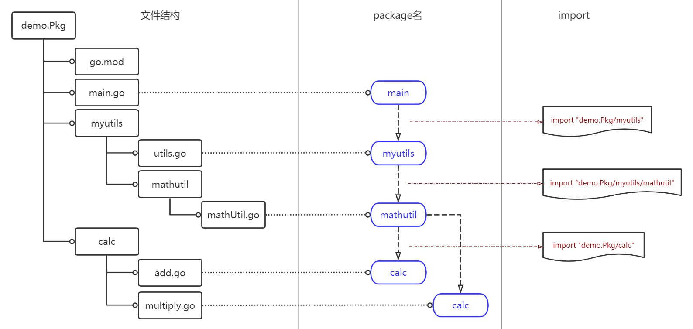
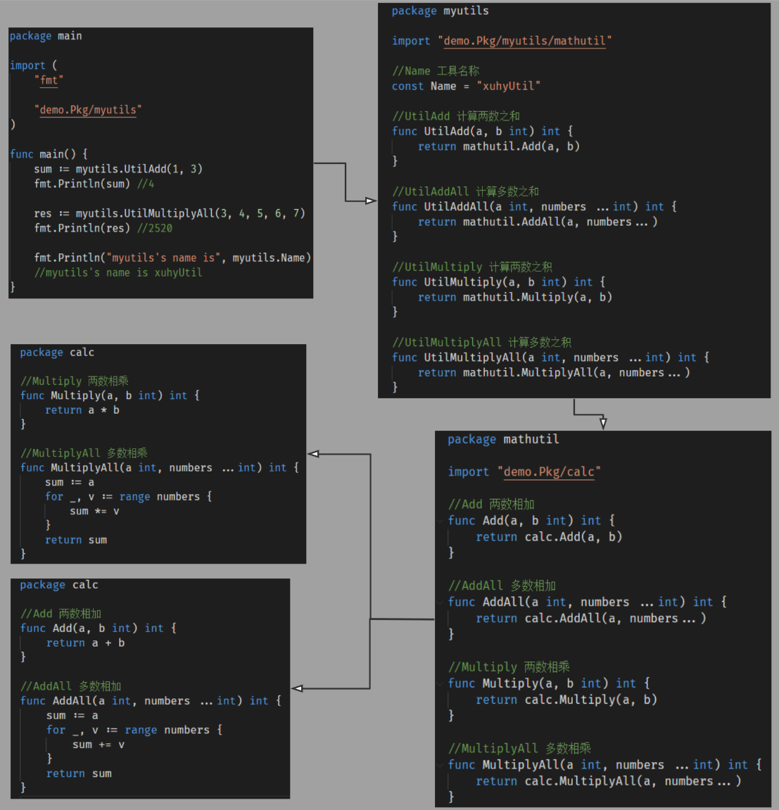

# 包的管理
Go语言的每个代码文件都属于一个包。一个包定义一组编译过的代码，包的名称类似命名空间，可以用来间接访问包内声明的函数、类型、常量和接口。这样就可以把不同的包中定义的同名标识符区分开。

## GOROOT和GOPATH
前面也提过，Go两个比较重要的环境变量：
1. **`GOROOT`，安装Go的路径**
2. **`GOPATH`，自定义的开发者的workspace**   

在控制台使用命令`go env`可以查看到当前Go定义的环境变量。
Go编译器查找包的顺序：`GOROOT` → `GOPATH`；如果无法找到会引发编译异常。比如引入了`fmt`包，编译器会查找到`/Users/xuhy/Go/src/ftm`(Mac OS)或`C:\Go\src\fmt`(Windows)。

## 使用go mod
使用`go mod`命令可以帮助我们生成一个项目模块（module）而摆脱必须在`%GOPATH%`下来创建自己项目的尴尬。所谓一个模块就是一系列的包（package）的集合。创建一个示例项目为例。   
首先`cd`到准备存放项目的目录，这里路径名称为`demo.Pkg`。接着执行`go mod init %项目名%`，按照惯例来说**路径名和项目名称应该一致比较好**。

```
> go mod init demo.Pkg

go: creating new go.mod: module demo.Pkg
```
可以看到提示，初始化成功了。命令帮我们创建了`go.mod`文件，包含这个文件的目录便是模块的根目录了。   
打开`go.mod`文件可以看到目前只包括了模块的名称（就是执行`go mod init %项目名%`时输入的名称）和Go的版本。`go.mod`文件中还可以定义模块的依赖项信息，就是本模块的工作需要依赖哪些其他模块。

## 引入自定义包
我们知道引用其他包的关键字是`import`，比如之前每个文件基本都有的`import "fmt"`。这引入的系统的包，这些系统包是存放在`%GOROOT%\src`中的，Go编译器会自动加载。   
（1）定义自己的包   
比如要创建一个用于简单计算的工具包，在根目录下创建目录命名为`calc`，在里面创建文件`add.go`与`multiply.go`。这两个文件的package名可以自定义，但是按照惯例最好与路径名称一致。**注意所有处于同一个文件夹里的go文件必须使用同一个package名。**

> add.go
```go
package calc

//Add 两数相加
func Add(a, b int) int {
	return a + b
}

//AddAll 多数相加
func AddAll(a int, numbers ...int) int {
	sum := a
	for _, v := range numbers {
		sum += v
	}
	return sum
}
```
> multiply.go
```go
package calc

//Multiply 两数相乘
func Multiply(a, b int) int {
	return a * b
}

//MultiplyAll 多数相乘
func MultiplyAll(a int, numbers ...int) int {
	sum := a
	for _, v := range numbers {
		sum *= v
	}
	return sum
}
```
（2）引用定义好的包
定义好自己的包之后，main函数就可以进行引用了。注意import的路径规则是`import %模块名%/[路径名]/包名`。如下所示：

```go
package main

import (
	"fmt"

	"demo.Pkg/calc"
)

func main() {
	sum := calc.Add(1, 2)
	fmt.Println(sum)    //3
	res := calc.MultiplyAll(2, 3, 4, 5)
	fmt.Println(res)    //120
}
```
了解这些基本规则，可以试试稍微复杂点的引用关系。可以看看本节的示例。
* 本例中的文件路径结构与其包的引用关系图：

* 本例中的代码引用关系：
   

## 支持远程包导入
很常见的情况是包在GitHub上，如果现在要导入一个远程的包，比如要引用postgres的驱动`import "github.com/lib/pq"`, 编译在导入它时，**会先在`GOPATH`下搜索这个包，如果没有，会在使用`go get`命令来获取远程的包，并且会把获取到的源代码存储在GOPATH目录下对应URL的目录里。**这之后会发现`go.mod`文件中多了依赖项。
```
module demo.Pkg

go 1.16

require (
	github.com/lib/pq v1.9.0
)
```

#### 重命名包
我们可以对引入的包进行命名，比如
```go
import(
	c "demo.Pkg/calc"
)

func main() {
	c.Add(1, 4)
}
```
Go语言中有一个挺不错的规则，**如果你使用import引入的包没有使用的话，编译器会报错。这就让我们不会引入多余的包**。

#### init函数
**`init`函数会在每个包完成初始化后自动执行，并且会在`main`函数之前执行**。`init`函数没有入参也没有返回值。`init`函数一般用来初始化一些变量或运行某些特殊的初始化动作。

```go
func init() {
	fmt.Println("main : initial...")
}

func main() {
	fmt.Println("main: main func") 
}
```
执行的输出：
```
> main : initial...
> main: main func
```
**Go编译器不允许声明导入某个包却不使用，但是如果需要某些包来执行其`init`函数的话，可以使用下划线来让Go编译器支持这样的导入并执行其`init`函数。**

```go
_ "github.com/goinaction/code/chapter2/sample/matchers"
```

# 公开和未公开标识符

之前都接触过，一个包中命名是大写字母开头的标识符是公开的(public)，被包外的代码可见。以小写字母开头的是未公开的(private)，则包外的代码不可见。如下示例
> demo/counters/counters.go
```go
package counters

//声明了未公开的类型
type alertCounter int
```
> demo/main.go
```go
package main

import (
	"fmt"

	"demo26/counters"
)

func main() {
	//创建一个未公开的类型的变量
	counter := counters.alertCounter(10)  //undeclared name: counters

	fmt.Printf("Counter: %d\n", counter)
}
```
由于counters包里的`alertCounter`是小写字母开头，所以该变量是未公开的，包外无法访问。如果改为`AlertCounter`则不会产生编译错误了。另一个办法则是为其定义构造函数的方式，如下示例将counters包里的实现改为工厂模式。
> demo/counters/counters.go
```go
package counters

//声明了未公开的类型
type alertCounter int

// New 创建并返回一个未公开的alertCounter 类型的值
func New(value int) alertCounter {
    return alertCounter(value)
}
```
> demo/main.go
```go
package main

import (
	"fmt"

	"demo26/counters"
)

func main() {
	//创建一个未公开的类型的变量
	//counter := counters.alertCounter(10) //error! : undeclared name: counters

	// 使用 counters 包公开的 New 函数来创建一个未公开的类型的变量
	counter := counters.New(10)

	fmt.Printf("Counter: %d\n", counter)
}
```
将工厂函数命名为`New`是Go语言的一个习惯。但是值得注意的是这个`New`函数创建了一个未公开的类型并赋值给了调用者，这个程序可以编译并且运行。
解释：

1. 公开或者未公开的标识符，不是一个值。就是说未公开的是`alertCounter`这个类型而不是`alertCounter`类型的变量值。
2. **短变声明操作符(:=)**有能力捕获引用的类型，并创建一个未公开的类型的变量。永远不能显式创建一个未公开的类型的变量，不过**短变声明操作符**可以这么做。

#### 可见标识符
再看一个例子
> demo/entities/entities.go
```go
package entities

// User 在程序里定义一个用户类型
type User struct {
	Name  string
	email string
}
```
> demo/main.go
```go
package main

import (
	"fmt"

	"demo26/counters"
)

func main() {
	// 创建 entities 包中的 User 类型的值
	u := entities.User{
		Name:  "Bill",
		email: "bill@email.com",  //unknown field email in struct literal
	}
}
```
很好理解，因为结构entities的字段`email`是小写字母开头，所以该字段是未公开的。相反`Name`则是公开的。如果将`entities`里面的`email`改为`Email`，则代码便可正常编译。如果继续将entities中的代码做如下修改。
> demo/entities/entities.go
```go
package entities

// user 在程序里定义一个用户类型
type user struct {
	Name  string
	Email string
}

// Admin 在程序里定义了管理员
type Admin struct {
	user   // 嵌入的类型是未公开的
	Rights int
}
```
将`User`改为`user`，即改为未公开类型。再声明多一个公开类型`Admin`，嵌入一个未公开的`user`类型。此时main函数再做如下调整。
> demo/main.go
```go
package main

import (
	"fmt"

	"demo26/entities"
)

func main() {
	// 创建 entities 包中的 Admin 类型的值
	a := entities.Admin{
		Rights: 10,
	}


	a.Name = "Bill"
	a.Email = "bill@email.com"
	fmt.Printf("User: %v\n", a)
}
```
创建了 entities 包中的`Admin`类型的值。由于内部类型`user`是未公开的，所以无法直接通过结构字面量的方式初始化该内部类型`user`。但是**由于嵌入类型的字段是公开的，又由于内部类型的标识符提升到了外部类型，所以这些内嵌类型的公开字段也可以通过外部类型的字段来访问**。

